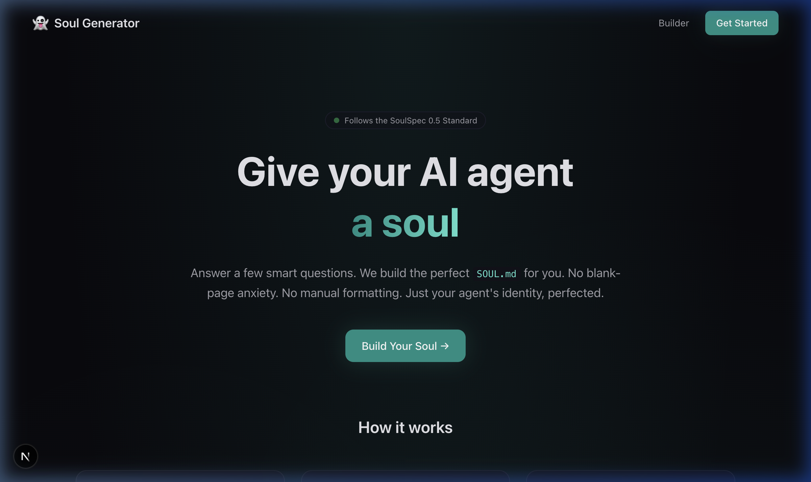

<p align="center">
  
</p>

<h1 align="center">👻 Soul Generator</h1>

<p align="center">
  <strong>A visual wizard for crafting AI agent personas — generates <code>SOUL.md</code> files following the <a href="https://github.com/clawsouls/soulspec/blob/main/soul-spec-v0.5.md">SoulSpec 0.5</a> standard.</strong>
</p>

<p align="center">
  
  
  
  
</p>

---

## What is this?

**Soul Generator** is an open-source web app that walks you through a step-by-step wizard to define your AI agent's personality, values, communication style, boundaries, and behavior — then exports a complete [SoulSpec](https://github.com/clawsouls/soulspec) package.

Instead of staring at a blank `SOUL.md` and guessing what to write, you answer smart questions and the tool assembles a well-structured identity file for you.

### What you get

| Export | Contents |
|--------|----------|
| **SOUL.md** | Core identity, values, communication style, boundaries, tool philosophy, memory policy, and error handling |
| **IDENTITY.md** | Agent name, role, and backstory |
| **STYLE.md** | Tone, humor, emoji policy, banned phrases |
| **AGENTS.md** | Session startup instructions, workspace rules |
| **soul.json** | SoulSpec v0.5 manifest with metadata, tags, framework compatibility |

All five files are bundled into a single **ZIP download**, or you can export just the `SOUL.md` or copy it to clipboard.

---

## Features

- 🎭 **15 Archetype Templates** — Coder, Assistant, Creative, DevOps, Writer, Tutor, Analyst, Support, Mentor, PM, Reviewer, Ops, Marketer, Therapist, or Custom
- 🪪 **Identity Builder** — Name, role, personality summary
- 💎 **Core Values Picker** — Choose from 20+ values with elaborations, add custom ones
- 💬 **Communication Tuning** — Sliders for tone/verbosity, humor style, emoji level, banned phrases
- 🛡️ **Boundary Builder** — Toggle guardrails, add custom hard limits
- 🔧 **Tool Philosophy** — Autonomy level, external action policy, destructive op policy
- 🧠 **Memory Configuration** — Persistence level, session awareness, memory priorities
- ⚡ **Error Handling** — Failure style, escalation threshold, debugging approach
- 🎯 **Domain Expertise** — Tag areas of knowledge with filter and custom tags
- 🔍 **Live Preview** — See your SOUL.md render in real-time
- 💾 **Auto-Save** — Progress saved to localStorage automatically
- 📦 **SoulSpec v0.5 ZIP Export** — Full package with all spec files

---

## Quick Start

```bash
# Clone the repo
git clone https://github.com/zachcantcode1/soulgenerator.git
cd soulgenerator

# Install dependencies
npm install

# Run dev server
npm run dev
```

Open [http://localhost:3000](http://localhost:3000) and start building.

---

## Tech Stack

| Layer | Technology |
|-------|-----------|
| Framework | [Next.js 16](https://nextjs.org/) (App Router, Turbopack) |
| Styling | [Tailwind CSS 4](https://tailwindcss.com/) |
| Language | TypeScript |
| Markdown | [react-markdown](https://github.com/remarkjs/react-markdown) |
| Export | [JSZip](https://stuk.github.io/jszip/) + [FileSaver.js](https://github.com/nicedrive/FileSaver.js) |

---

## Project Structure

```
src/
├── app/
│   ├── page.tsx              # Landing page
│   ├── globals.css           # Design system (CSS variables, components)
│   ├── layout.tsx            # Root layout with metadata
│   └── builder/
│       ├── page.tsx           # Builder page wrapper
│       ├── WizardContent.tsx  # Main wizard shell (progress, nav, preview)
│       ├── PreviewPanel.tsx   # Live SOUL.md preview + export buttons
│       └── steps/
│           ├── StepArchetype.tsx
│           ├── StepIdentity.tsx
│           ├── StepValues.tsx
│           ├── StepCommunication.tsx
│           ├── StepBoundaries.tsx
│           ├── StepToolPhilosophy.tsx
│           ├── StepMemory.tsx
│           ├── StepErrorHandling.tsx
│           └── StepExpertise.tsx
└── lib/
    ├── types.ts              # TypeScript types + step config
    ├── templates.ts          # Archetype defaults + option lists
    ├── store.tsx             # React context + reducer + localStorage
    ├── generator.ts          # SOUL.md template assembly
    └── export.ts             # soul.json, IDENTITY.md, STYLE.md, AGENTS.md, ZIP
```

---

## SoulSpec Compatibility

Soul Generator targets [SoulSpec v0.5](https://github.com/clawsouls/soulspec/blob/main/soul-spec-v0.5.md). The generated `soul.json` includes:

- `specVersion: "0.5"`
- Framework compatibility (`cursor`, `windsurf`, `continue`, `openclaw`)
- Category paths mapped to archetypes
- Progressive disclosure support (`disclosure.summary`)
- Proper SPDX licensing

The generated files work with any agent framework that reads `SOUL.md` — drop the exported package into your project root and your AI agent picks it up.

---

## License

[MIT](LICENSE)
